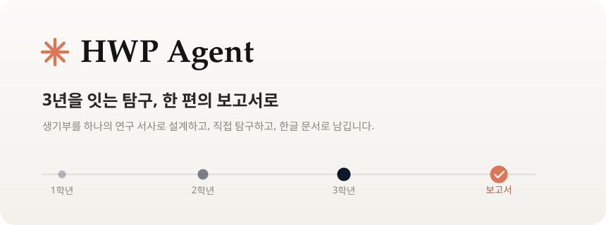
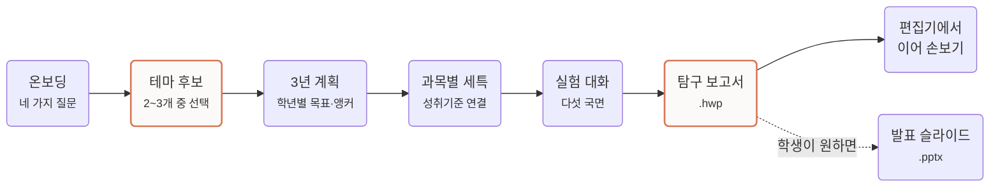
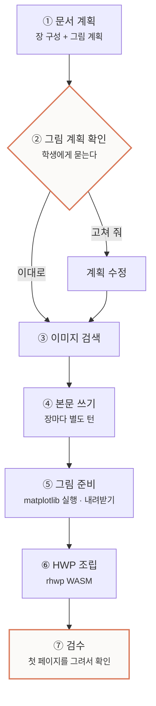
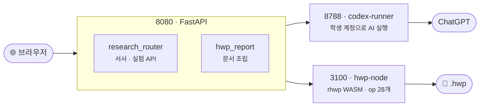

<a id="readme-top"></a>

<div align="center">

<picture>
  <source media="(prefers-color-scheme: dark)" srcset="docs/assets/banner-dark.svg">
  
</picture>

<br><br>

<p>
  
  
  
  
</p>

**생기부는 단발성 활동의 나열이 아니라, 하나의 테마 아래 3년간 깊어지는 서사여야 합니다.**<br>
이 앱은 그 서사를 학생이 직접 설계하고, 직접 탐구하고, 그 기록을 진짜 한글 문서로 남기게 돕습니다.

</div>

<br>

## 목차

[원칙](#-앱이-지키는-두-가지) · [학생이 지나는 길](#-학생이-지나는-길) · [무엇이 되는가](#-무엇이-되는가) · [보고서가 만들어지는 과정](#-보고서가-만들어지는-과정) · [구조](#-구조) · [시작하기](#-시작하기) · [개발 노트](#-개발-노트) · [남은 일](#-남은-일)

<br>

## 🧭 앱이 지키는 두 가지

> ### 1. AI가 대신 해주지 않는다
> 관찰·측정·판단은 학생 몫입니다. Agent는 배경 자료를 찾아 주고, 무엇을 확인해야
> 하는지 묻습니다. **대화에 없는 수치는 보고서에도 들어가지 않습니다.**
> 측정값 입력기조차 열 이름만 정해 주고 값은 비워 둡니다 — 잰 사람은 학생이니까요.

> ### 2. ChatGPT 연결은 토큰이지 로그인이 아니다
> 학생이 자기 ChatGPT 계정을 연결하면 그 계정의 사용 한도로 Codex가 돕습니다.
> 앱 신원은 이메일 로그인이 정합니다. 예전에는 연결이 곧 로그인이었는데,
> **같은 계정을 연결한 사람이 남의 설계·실험·보고서를 그대로 열어볼 수 있었습니다.**

<br>

## 🗺 학생이 지나는 길



실험 대화는 다섯 국면을 순서대로 지납니다. 각 국면에서 **학생이 답한 것만이**
보고서의 재료가 됩니다.

| | 국면 | 학생이 하는 일 | Agent가 하는 일 |
|:--:|---|---|---|
| **1** | 배경 조사 | 무엇을 이미 아는지 말한다 | 선행 사례·자료를 출처와 함께 찾아 준다 |
| **2** | 탐구 설계 | 변인과 방법을 정한다 | 통제할 변인을 되묻는다 |
| **3** | 실행 · 관찰 | **직접 재고 기록한다** | 측정값 표를 열어 준다 (값은 비운 채) |
| **4** | 결과 정리 | 수치를 읽고 경향을 말한다 | 정리 방식을 제안한다 |
| **5** | 결론 · 한계 | 결론과 한계를 스스로 쓴다 | 빠진 관점을 짚어 준다 |

<br>

## ✨ 무엇이 되는가

<table>
<tr>
<td width="50%" valign="top">

#### 🔍 자료 조사
Codex 웹 검색으로 배경 자료를 **출처와 함께**. 눈으로 봐야 이해되는 것은
이미지로 대화에 바로 띄웁니다.

</td>
<td width="50%" valign="top">

#### 📊 측정값 표
폰으로 값만 넣으면 됩니다. 실험은 책상이 아니라 주방·운동장에서 하니까요.
그대로 **진짜 HWP 표**가 됩니다.

</td>
</tr>
<tr>
<td valign="top">

#### 🧪 직접 눌러볼 화면
버튼 문구 비교처럼 만져 봐야 아는 탐구는 Agent가 화면을 만들어
샌드박스 iframe으로 띄웁니다.

</td>
<td valign="top">

#### 📄 보고서 조립
계획 → 장별 집필 → 그림 준비 → HWP 조립 → 검수.
**단계가 화면에 보입니다.**

</td>
</tr>
<tr>
<td valign="top">

#### 🔬 문서 점검
본문에서 언급 안 된 그림, 건너뛴 장 번호, 어긋난 정렬을 짚습니다.
**고치지는 않습니다** — 그건 학생 몫입니다.

</td>
<td valign="top">

#### ✅ 성취기준 검증
보고서가 설계 때 고른 기준에 실제로 닿았는지 대조합니다.
생기부에 적힌 뒤에는 늦으니까요.

</td>
</tr>
<tr>
<td valign="top">

#### 🔗 3년 서사 검사
보고서들을 가로로 놓고, 앞의 질문과 한계를 뒤가 이어받았는지 봅니다.

</td>
<td valign="top">

#### 🎤 발표 자료
원하면 슬라이드로. 슬라이드마다 **발표 메모**가 붙습니다.

</td>
</tr>
</table>

<br>

## 📄 보고서가 만들어지는 과정

대화가 끝나면 일곱 단계가 순서대로 돕니다. 한 장이 실패해도 나머지는 완성되고,
무엇이 빠졌는지는 단계판에 남습니다.



> **②에서 실제로 학생에게 묻습니다.** 어떤 그림이 문서에 실릴지는 학생이 정할
> 문제입니다. 5분 안에 답이 없으면 계획대로 진행합니다 — 기다리다 멈추지 않습니다.

<br>

## 🏗 구조

세 프로세스가 함께 돕니다. 브라우저는 **8080만** 봅니다.



> ⚠️ **하나라도 빠지면 조용히 망가집니다.** hwp-node가 죽으면 보고서가 HWP 대신
> DOCX로 나오고, codex-runner가 없으면 AI 단계가 전부 멈춥니다.
> `curl localhost:3100/health` · `curl localhost:8788/health` 로 확인하세요.

<details>
<summary><b>📁 코드 지도</b></summary>

```
app.py                     FastAPI 본체 · 인증 · 리로스쿨 · 관리자
modules/
  research_router.py       연구 서사·실험 API 전부 (/api/research/*)
  research_pipeline.py     Codex 프롬프트와 출력 스키마
  research_store.py        DB 접근 + 상태 머신 (draft → narrowing → fixed)
  codex_auth.py            ChatGPT 기기 코드 연결 (로그인이 아님)
  codex_runner.py          Runner HTTP 클라이언트
  hwp_report.py            보고서 → 진짜 HWP 조립
  hwp_inspect.py           만든 보고서 되짚어 보기
  ppt_report.py            발표 슬라이드
  report_figures.py        그림 준비 (matplotlib 실행 · 이미지 내려받기)
  web_search.py            검색 폴백 (Brave · Google CSE · 네이버 · 위키미디어)
static/js/
  shell.js                 테마 · 사이드바 · 알림 · 계정 · 리로스쿨 · 캘린더
  home.js                  첫 화면 — 지금 할 일
  guide.js                 설계 · 실험 대화
  history.js               사이드바 대화 목록
  research.js              /research 3년 로드맵
services/
  codex-runner/            HWP 전용 Codex Runner
  hwp-node/                rhwp 사이드카 (읽기 op 6개 · 쓰기 op 22개)
data/
  curriculum/              2022 개정 교육과정 — 과목 231 · 성취기준 3,124
  reference_sources/       공식 원자료 (고시 · 성취수준 · 생기부 기재요령)
  hwp_corpus/              공문서 50건에서 뽑은 서식 스타일 킷
legacy/                    걷어낸 옛 문서 생성 경로 (되돌리는 법은 그 안 README)
```

</details>

<br>

## 🚀 시작하기

### 준비물

`Python 3.12` · `Node 20+` · ChatGPT 계정 (Plus 이상 권장)

### 설치

```bash
git clone https://github.com/diddmstjr07/HWPAgent.git
cd HWPAgent

python3 -m venv .venv && source .venv/bin/activate
pip install -r requirements.txt

cp .env.example .env      # 아래 표를 보고 채웁니다
```

### 실행 — 세 프로세스를 모두 띄웁니다

```bash
# ① HWP 사이드카
cd services/hwp-node && npx tsx src/index.ts

# ② Codex Runner
cd services/codex-runner && \
  AI_RUNNER_DATA_DIR=/tmp/hwp-runner-data PORT=8788 node server.mjs

# ③ 앱 본체
.venv/bin/python -m uvicorn app:app --host 0.0.0.0 --port 8080
```

`--host 0.0.0.0` 이면 같은 와이파이의 폰에서도 들어옵니다. 학생들은 폰·태블릿을
더 많이 쓰므로 그쪽에서 확인하는 편이 낫습니다.

### 환경 변수

| 키 | 설명 |
|---|---|
| `SECRET_KEY` | 세션 서명 키 |
| `CODEX_RUNNER_URL`<br>`CODEX_RUNNER_SHARED_SECRET` | Runner 주소와 공유 비밀 (**32자 이상**) |
| `ACCOUNT_IDENTITY_SECRET` | ChatGPT 계정 해시용 HMAC 키 |
| `HWP_NODE_URL`<br>`HWP_NODE_API_KEY` | HWP 사이드카 |
| `PUBLIC_BASE_URL` | 메일 링크에 쓸 공개 주소 |
| `BRAVE_SEARCH_API_KEY` 등 | 검색 폴백 — 없으면 위키미디어만 동작 |
| `SMTP_*` | 학번 갱신 안내 메일 |

<br>

## 🔧 개발 노트

### 테스트

```bash
.venv/bin/python -m unittest discover -s tests    # 162 passing
```

### 실측하세요, 추측하지 말고

이 프로젝트에서 가장 아팠던 버그 두 개는 **데이터 검사로는 잡히지 않았습니다.**
페이지를 실제로 그려서 눈으로 봐야 발견됐습니다.

| 함정 | 무슨 일이 났나 |
|---|---|
| `fontSize`는 pt가 아니라 **pt × 100** | 11을 넣으면 0.11pt. "글자는 있는데 아무것도 안 보이는" 문서가 나옵니다 |
| 정렬 키는 `align`이 아니라 **`alignment`** | 값도 소문자여야 하고, **모든 문단에 명시**해야 합니다. 한 문단만 바꾸면 지정 안 한 문단이 따라 움직입니다 |

그래서 문서를 만들면 첫 페이지를 실제로 렌더해서 확인합니다.

```bash
curl -s localhost:3100/sessions/{id}/pages/0 > page.svg
qlmanage -t -o . page.svg          # SVG → PNG, 눈으로 확인
```

### 알아둘 것

- 정적 파일을 고치면 `templates/*.html` 의 `?v=` 캐시 버전을 올려야 반영됩니다.
- 코드 주석은 **왜 그렇게 했는지**를 한국어로 적습니다.
- 앱을 재시작하면 러너에 진행 중이던 턴이 최대 180초 남아 새 요청을 막습니다.

<br>

## 📌 남은 일

- [ ] codex-runner 배포 — 지금은 로컬 전용
- [ ] 검색 API 키 발급 — Brave 무료 2,000/월, 국내 자료는 네이버 병행
- [ ] hwp-node 자동 재기동(launchd) — 조용히 죽으면 보고서가 DOCX로 빠집니다
- [ ] 설계 채팅에도 단계 파이프라인 적용
- [ ] `/api/documents` 신원 갈아치기 정리 — 채팅 쪽은 해결됨

<br>

## 라이선스 · 문의

라이선스 미정입니다. 상업·배포 전에 문의해 주세요.

**Maintainer** — [@diddmstjr07](https://github.com/diddmstjr07) ·
**Issues** — [github.com/diddmstjr07/HWPAgent/issues](https://github.com/diddmstjr07/HWPAgent/issues)

<p align="right"><a href="#readme-top">맨 위로 ↑</a></p>
