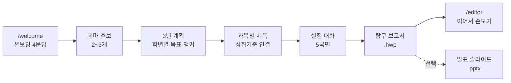

<a id="readme-top"></a>

<div align="center">


# HWP Agent

**고등학생이 3년치 생기부를 하나의 연구 서사로 설계하고,<br>직접 탐구하고, 그 기록을 한글 보고서로 남기는 곳**

<p>
  
  
  
  
</p>

</div>

<br>

## 이 앱이 지키는 두 가지

> **1. AI가 대신 해주지 않는다.**
> 관찰·측정·판단은 학생 몫입니다. Agent는 배경 자료를 찾아주고 다음에 무엇을
> 할지 물을 뿐입니다. **대화에 없는 수치는 보고서에도 들어가지 않습니다.**

> **2. ChatGPT 연결은 토큰이지 로그인이 아니다.**
> 학생이 자기 ChatGPT 계정을 연결하면 그 계정의 사용 한도로 Codex가 돕습니다.
> 앱 신원은 이메일 로그인이 정합니다 — 연결이 곧 로그인이면 같은 계정을 쓴
> 사람이 남의 기록을 열어보게 됩니다.

<br>

## 학생이 지나는 길



실험은 **배경 조사 → 탐구 설계 → 실행·관찰 → 결과 정리 → 결론·한계**의 다섯
국면을 지납니다. 학생이 각 국면에서 답한 것만이 보고서의 재료가 됩니다.

<br>

## 무엇이 자동으로 되는가

| | 하는 일 |
|---|---|
| 🔍 **자료 조사** | Codex 웹 검색으로 배경 자료·사례를 출처와 함께. 눈으로 봐야 하는 것은 이미지로 |
| 📊 **측정값 표** | 폰으로 값만 넣으면 보고서에서 진짜 HWP 표가 됩니다 |
| 📄 **보고서 조립** | 계획 → 장별 집필 → 그림 준비 → HWP 조립 → 검수. 단계가 화면에 보입니다 |
| 🔬 **문서 점검** | 본문에서 언급 안 된 그림, 건너뛴 장 번호, 어긋난 정렬을 짚어줍니다 |
| ✅ **성취기준 검증** | 보고서가 설계 때 고른 기준에 실제로 닿았는지 대조합니다 |
| 🔗 **서사 점검** | 보고서들을 가로로 놓고 앞의 질문을 뒤가 이어받았는지 봅니다 |
| 🎤 **발표 자료** | 원하면 슬라이드로. 슬라이드마다 발표 메모가 붙습니다 |

<br>

## 구조

세 프로세스가 함께 돕니다. 브라우저는 **8080만** 봅니다.

```
                    ┌──────────────────────────┐
   브라우저  ─────▶ │  8080  FastAPI (app.py)  │
                    └────────┬────────┬────────┘
                             │        │
             ┌───────────────┘        └──────────────┐
             ▼                                       ▼
   ┌────────────────────┐                ┌──────────────────────┐
   │ 8788 codex-runner  │                │ 3100 hwp-node        │
   │ 세션마다 codex를   │                │ rhwp WASM            │
   │ 띄워 학생 계정으로 │                │ HWP 열기·편집·조립·  │
   │ AI를 돌린다        │                │ 렌더·내보내기        │
   └────────────────────┘                └──────────────────────┘
```

### 코드 지도

```
app.py                     FastAPI 본체 · 인증 · 리로스쿨 · 관리자
modules/
  research_router.py       연구 서사·실험 API 전부 (/api/research/*)
  research_pipeline.py     Codex 프롬프트와 출력 스키마
  research_store.py        DB 접근 + 상태 머신 (draft/narrowing/fixed)
  codex_auth.py            ChatGPT 기기 코드 연결 (로그인이 아님)
  codex_runner.py          Runner HTTP 클라이언트
  hwp_report.py            보고서 → 진짜 HWP 조립
  hwp_inspect.py           만든 보고서 되짚어 보기
  ppt_report.py            발표 슬라이드
  report_figures.py        그림 준비 (matplotlib 실행 / 이미지 내려받기)
  web_search.py            검색 폴백 (Brave · Google CSE · 네이버 · 위키미디어)
static/js/
  shell.js                 테마 · 사이드바 · 알림 · 계정 · 리로스쿨 · 캘린더
  home.js                  첫 화면 — 지금 할 일
  guide.js                 설계 · 실험 대화
  history.js               사이드바 대화 목록
  research.js              /research 3년 로드맵
services/
  codex-runner/            HWP 전용 Codex Runner
  hwp-node/                rhwp 사이드카 (읽기 op 6개 · 쓰기 op 24개)
legacy/                    걷어낸 옛 문서 생성 경로 (README 참고)
```

<br>

## 시작하기

### 준비물

- Python **3.12**
- Node **20+** (hwp-node · codex-runner)
- ChatGPT 계정 (Plus 이상 권장)

### 설치

```bash
git clone https://github.com/diddmstjr07/HWPAgent.git
cd HWPAgent

python3 -m venv .venv && source .venv/bin/activate
pip install -r requirements.txt

cp .env.example .env      # 아래 표를 보고 채웁니다
```

### 실행 — 세 프로세스를 모두 띄웁니다

```bash
# ① HWP 사이드카
cd services/hwp-node && npx tsx src/index.ts

# ② Codex Runner
cd services/codex-runner && \
  AI_RUNNER_DATA_DIR=/tmp/hwp-runner-data PORT=8788 node server.mjs

# ③ 앱 본체
.venv/bin/python -m uvicorn app:app --host 0.0.0.0 --port 8080
```

> **하나라도 빠지면** 조용히 망가집니다. hwp-node가 죽으면 보고서가 HWP 대신
> DOCX로 나오고, codex-runner가 없으면 AI 단계가 전부 멈춥니다.
> `curl localhost:3100/health` 와 `curl localhost:8788/health` 로 확인하세요.

### 환경 변수

| 키 | 설명 |
|---|---|
| `SECRET_KEY` | 세션 서명 키 |
| `CODEX_RUNNER_URL` · `CODEX_RUNNER_SHARED_SECRET` | Runner 주소와 공유 비밀(32자 이상) |
| `ACCOUNT_IDENTITY_SECRET` | ChatGPT 계정 해시용 HMAC 키 |
| `HWP_NODE_URL` · `HWP_NODE_API_KEY` | HWP 사이드카 |
| `PUBLIC_BASE_URL` | 메일 링크에 쓸 공개 주소 |
| `BRAVE_SEARCH_API_KEY` 등 | 검색 폴백 (없으면 위키미디어만) |
| `SMTP_*` | 학번 갱신 안내 메일 |

<br>

## 개발 노트

### 테스트

```bash
.venv/bin/python -m unittest discover -s tests
```

### 실측하세요, 추측하지 말고

이 프로젝트에서 가장 아팠던 버그 두 개는 **데이터 검사로는 안 잡혔습니다.**

- `fontSize`는 pt가 아니라 **pt × 100**입니다. 11을 넣으면 0.11pt가 되어
  "글자는 있는데 아무것도 안 보이는" 문서가 나옵니다.
- 정렬 키는 `align`이 아니라 **`alignment`**(값도 소문자)이고, **모든 문단에
  명시**해야 합니다. 한 문단만 바꾸면 지정하지 않은 문단이 따라 움직입니다.

그래서 문서를 만들면 첫 페이지를 실제로 그려서 확인합니다.

```bash
# SVG 렌더 → PNG 로 눈으로 확인
curl -s localhost:3100/sessions/{id}/pages/0 > page.svg && qlmanage -t -o . page.svg
```

### 알아둘 것

- 정적 파일을 고치면 `templates/*.html`의 `?v=` 캐시 버전을 올려야 반영됩니다.
- 코드 주석은 **왜 그렇게 했는지**를 한국어로 적습니다.
- 앱을 재시작하면 러너에 진행 중이던 턴이 최대 180초 남아 새 요청을 막습니다.

<br>

## 남은 일

- [ ] codex-runner 배포 (지금은 로컬 전용)
- [ ] 검색 API 키 발급 — Brave 무료 2000/월, 국내 자료는 네이버 병행
- [ ] hwp-node 자동 재기동 (launchd) — 조용히 죽으면 보고서가 DOCX로 빠집니다
- [ ] 설계 채팅에도 단계 파이프라인 적용
- [ ] `/api/documents` 의 신원 갈아치기 정리 (채팅 쪽은 해결됨)

<br>

## 라이선스 · 문의

라이선스 미정입니다. 상업·배포 전에 문의해 주세요.

- Maintainer — [@diddmstjr07](https://github.com/diddmstjr07)
- Issues — [github.com/diddmstjr07/HWPAgent/issues](https://github.com/diddmstjr07/HWPAgent/issues)

<p align="right">(<a href="#readme-top">맨 위로</a>)</p>
