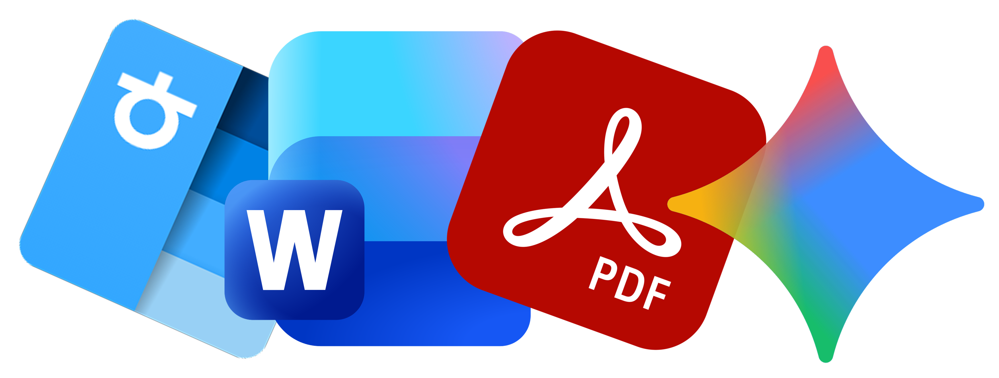

<!-- Improved compatibility of back to top link: see https://github.com/othneildrew/Best-README-Template -->
<a id="readme-top"></a>

<div align="center">
  <h1>HWP Agent</h1>
  <p>
    
  </p>
  <p>Gemini + LangChain 기반 한국어 HWP/HWPX 문서 자동 생성·포맷팅 에이전트</p>
  <p>
    <a href="https://github.com/diddmstjr07/HWPAgent/issues">Report Bug</a>
    ·
    <a href="https://github.com/diddmstjr07/HWPAgent/issues">Request Feature</a>
  </p>
  <p>
    <a href="https://www.python.org/"></a>
    <a href="https://flask.palletsprojects.com/"></a>
    <a href="https://ai.google.dev/"></a>
    <a href="#license"></a>
  </p>
</div>

---

<details>
  <summary>Table of Contents</summary>
  <ol>
    <li><a href="#about-the-project">About The Project</a></li>
    <li><a href="#built-with">Built With</a></li>
    <li><a href="#getting-started">Getting Started</a></li>
    <li><a href="#usage">Usage</a></li>
    <li><a href="#api-reference">API Reference</a></li>
    <li><a href="#roadmap">Roadmap</a></li>
    <li><a href="#contributing">Contributing</a></li>
    <li><a href="#license">License</a></li>
    <li><a href="#contact">Contact</a></li>
    <li><a href="#acknowledgments">Acknowledgments</a></li>
  </ol>
</details>

## About The Project

HWP Agent는 한국어 문서를 빠르게 작성해야 하는 팀을 위해 만들어진 경량 문서 생성 자동화 도구입니다. 자연어로 요청하면 Gemini 모델이 콘텐츠를 작성하고, LangChain 워크플로와 전용 HWPX 핸들러가 제목·본문·표·이미지 설명을 구성합니다. Flask 기반 REST API와 Web UI, CLI 인터페이스를 모두 제공하여 어디서든 동일한 파이프라인을 재사용할 수 있습니다.

## Built With

- Python 3.10+
- Flask 3.x, Flask-CORS
- LangChain, Google Gemini API (`gemini-2.5-flash`)
- python-docx, custom HWPX builder, LibreOffice CLI
- BeautifulSoup + Selenium (이미지 검색/다운로드)
- SQLite (사용자/문서 히스토리 예정)

## Getting Started

### Prerequisites
- Python 3.10+
- pip / virtualenv
- Gemini API 키 ([Google AI Studio](https://ai.google.dev/))

### Installation
```bash
git clone https://github.com/diddmstjr07/HWPAgent.git
cd HWPAgent
python3 -m venv venv && source venv/bin/activate  # Windows: venv\Scripts\activate
pip install --upgrade pip
pip install -r requirements.txt
cp .env.example .env  # GOOGLE_API_KEY, SECRET_KEY 등 설정
```

### Run
```bash
# CLI 단발 실행
python main.py "AI 기반 업무 자동화 제안서를 작성해줘"

# Flask Web UI / API
flask --app app.py run --host=0.0.0.0 --port=5000
```

## Usage

- **CLI**  
  ```bash
  python main.py "분기 보고서" \
    --format hwpx \
    --context "매출 +15%, 신규 파트너 3곳" \
    --output-dir ./reports/q1
  ```
- **Interactive**: `python main.py --interactive`
- **Web UI**: `http://localhost:5000` 접속 후 프롬프트 입력 → 스트리밍으로 결과 확인 → 저장

## API Reference

| Endpoint | Method | Description |
| --- | --- | --- |
| `/api/generate` | POST | JSON 요청으로 문서 생성 |
| `/api/generate-stream` | POST | SSE 기반 실시간 생성 |
| `/api/save` | POST | 문서 저장 및 이미지 다운로드 |

Example:
```bash
curl -X POST http://localhost:5000/api/generate \
  -H "Content-Type: application/json" \
  -d '{"request": "스마트워크 도입 백서를 작성해줘"}'
```

## Roadmap

- [x] Gemini 기반 HWPX/Markdown/DOCX 생성
- [x] Google 이미지 자동 검색/삽입
- [ ] 사용자별 히스토리/컨텍스트 저장
- [ ] 멀티모달 입력 파이프라인
- [ ] Docker 배포 및 CI
- [ ] Admin 대시보드

## Contributing

1. Fork the repo
2. Create feature branch (`git checkout -b feature/amazing`)
3. Commit (`git commit -m "feat: add amazing thing"`)
4. Push (`git push origin feature/amazing`)
5. Open a Pull Request

버그 리포트 및 기능 제안은 Issue를 통해 남겨주세요.

## License

라이선스는 확정되지 않았습니다. 상업/배포 전에 반드시 문의해 주세요.

## Contact

- Maintainer: [@diddmstjr07](https://github.com/diddmstjr07)  
- Issues: [github.com/diddmstjr07/HWPAgent/issues](https://github.com/diddmstjr07/HWPAgent/issues)

## Acknowledgments

- [Best-README-Template](https://github.com/othneildrew/Best-README-Template)에서 영감을 받아 구조를 구성했습니다.
- Google AI Studio, LangChain 커뮤니티 자료에 감사드립니다.

<p align="right">(<a href="#readme-top">back to top</a>)</p>
