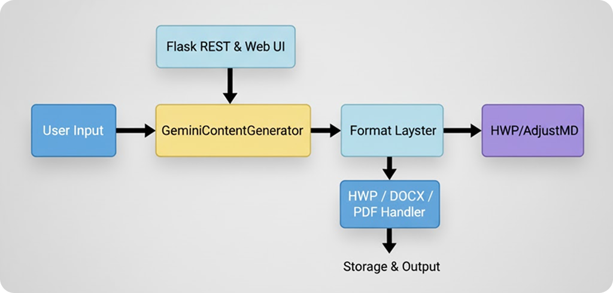

# HWP Agent

Gemini + LangChain 기반으로 한국어 HWP/HWPX 문서를 자동 생성하고 저장하는 경량 문서 작성 에이전트입니다.

## 주요 기능
- Gemini `gemini-2.5-flash` 모델로 제목·본문·표·이미지 설명 자동 생성
- HWPX·DOCX·Markdown·PDF 출력 및 스트리밍 기반 웹 UI/REST API
- Google 이미지 검색 자동화로 문서에 맞는 이미지를 다운로드 및 포함

## 빠른 시작
```bash
git clone https://github.com/diddmstjr07/HWPAgent.git
cd HWPAgent
python3 -m venv venv && source venv/bin/activate
pip install -r requirements.txt
cp .env.example .env  # GOOGLE_API_KEY 등 채우기
flask --app app.py run
```

## 사용 방법
- **CLI**: `python main.py "AI 보고서를 작성해줘" --format hwpx --context "매출 15% 성장"`
- **Web**: `http://localhost:5000` 접속 후 프롬프트 입력 → 실시간 스트리밍 결과 확인 → 저장
- **API**: `POST /api/generate` 또는 `/api/generate-stream` 로 JSON 요청

## 로드맵


## 기여
이슈/PR 모두 환영합니다. 단순 버그 리포트라도 감사히 받습니다.

## 라이선스
프로젝트는 현재 사내 검토 중이며, 사용 전에 라이선스 관련 문의를 부탁드립니다.
